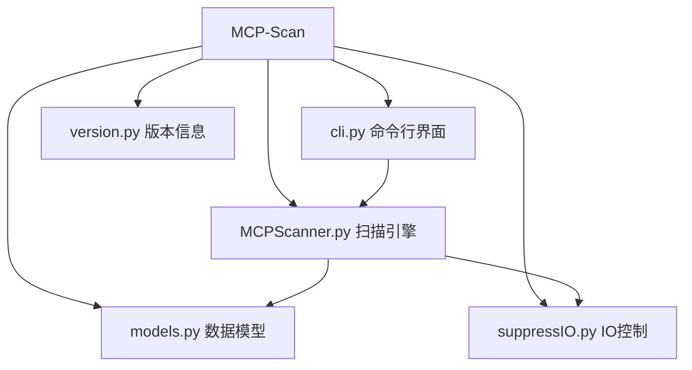
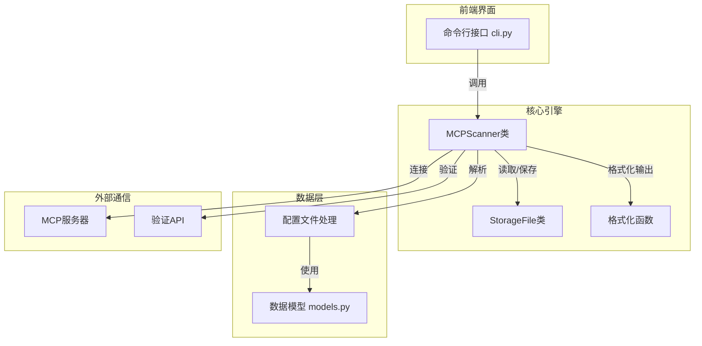
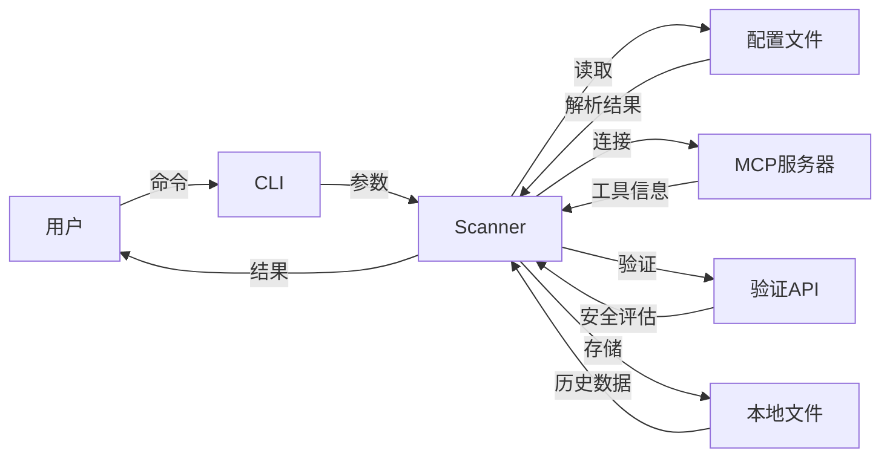
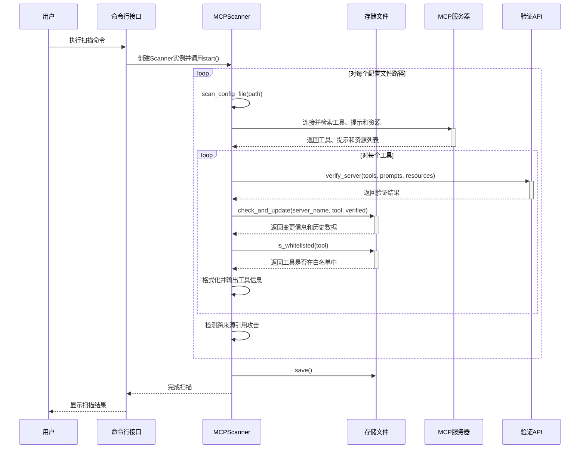
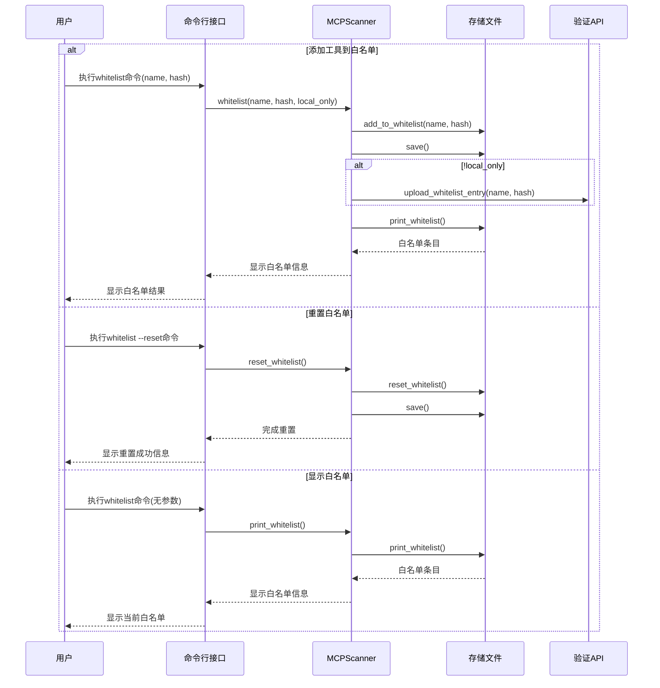
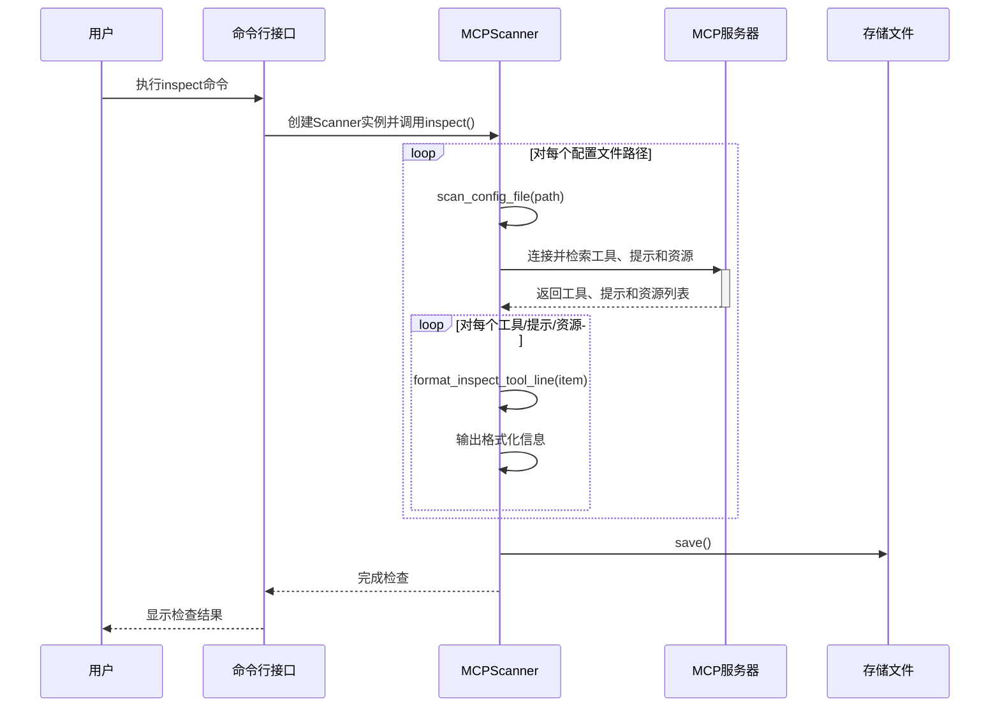

# MCP-Scan: An MCP Security Scanner

<a href="https://discord.gg/dZuZfhKnJ4"></a>

MCP-Scan is a security scanning tool designed to go over your installed MCP servers and check them for common security vulnerabilities like [prompt injections](https://invariantlabs.ai/blog/mcp-security-notification-tool-poisoning-attacks), [tool poisoning](https://invariantlabs.ai/blog/mcp-security-notification-tool-poisoning-attacks) and [cross-origin escalations](https://invariantlabs.ai/blog/mcp-security-notification-tool-poisoning-attacks).

## 代码组织与架构

### 核心模块结构

MCP-Scan项目采用模块化设计，核心模块如下：



### 组件关系与通信流程



### 主要组件功能

1. **命令行接口 (cli.py)**
   - 处理用户命令行参数
   - 根据命令创建MCPScanner实例并调用相应方法

2. **扫描引擎 (MCPScanner.py)**
   - MCPScanner类：提供扫描、检查和白名单管理的核心功能
   - StorageFile类：管理本地存储的工具信息和白名单
   - 格式化函数：生成格式化的输出文本

3. **数据模型 (models.py)**
   - 定义配置文件结构的Pydantic模型
   - 支持多种客户端配置格式(Claude、VSCode等)
   - 服务器类型模型(SSE和Stdio)

4. **IO控制 (suppressIO.py)**
   - 控制MCP服务器输出的抑制

### 组件间通信

- **用户 → CLI**：通过命令行参数向程序传达意图
- **CLI → Scanner**：将参数传递给Scanner类
- **Scanner → 配置文件**：读取并解析配置文件
- **Scanner → MCP服务器**：使用mcp库连接服务器并获取工具信息
- **Scanner → 验证API**：将工具描述发送到验证服务器检查安全问题
- **Scanner → Storage**：检查工具描述变化和白名单状态
- **Scanner → 控制台**：格式化输出扫描结果

### 数据流向



## 工作流程

以下时序图展示了MCP-Scan工具的工作流程：

### 扫描功能工作流程



### 白名单功能工作流程



### 检查功能工作流程



## Quick Start
To run MCP-Scan, use the following command:

```bash
uvx mcp-scan@latest
```

### Example Output


## Features

- Scanning of Claude, Cursor, Windsurf, and other file-based MCP client configurations
- Scanning for prompt injection attacks in tool descriptions and [tool poisoning attacks](https://invariantlabs.ai/blog/mcp-security-notification-tool-poisoning-attacks) using [Invariant Guardrails](https://github.com/invariantlabs-ai/invariant?tab=readme-ov-file#analyzer)
- Detection of cross-origin escalation attacks ([tool shadowing](https://invariantlabs.ai/blog/mcp-security-notification-tool-poisoning-attacks))
- _Tool Pinning_ to detect and prevent [MCP rug pull attacks](https://invariantlabs.ai/blog/mcp-security-notification-tool-poisoning-attacks), i.e. detects changes to MCP tools via hashing
- Inspecting the tool descriptions of installed tools via `uvx mcp-scan@latest inspect`

## How It Works
MCP-Scan searches through your configuration files to find MCP server configurations. It connects to these servers and retrieves tool descriptions.

It then scans tool descriptions, both with local checks and by invoking Invariant Guardrailing via an API. For this, tool names and descriptions are shared with invariantlabs.ai. By using MCP-Scan, you agree to the invariantlabs.ai [terms of use](https://explorer.invariantlabs.ai/terms) and [privacy policy](https://invariantlabs.ai/privacy-policy).

Invariant Labs is collecting data for security research purposes (only about tool descriptions and how they change over time, not your user data). Don't use MCP-scan if you don't want to share your tools.

MCP-scan does not store or log any usage data, i.e. the contents and results of your MCP tool calls.

## CLI parameters

```

usage: uvx mcp-scan@latest [--storage-file STORAGE_FILE] [--base-url BASE_URL]

help
    Prints this help message

whitelist 
    Whitelists a tool, or prints the current whitelist if no arguments are provided

    [NAME HASH]
        Adds tool name and hash to whitelist
        
    [--reset]
        Resets the whitelist
    
    [--local-only]
        Do not contribute to the global whitelist.
        Defaults to False
    
scan 
    Scan MCP servers
    Default command, when no arguments are provided

    [FILE1] [FILE2] [FILE3] ...
        Different file locations to scan. This can include custom file locations as long as they are in an expected format, including Claude, Cursor or VSCode format.
        Defaults to well known locations, depending on your OS
        
    [--checks-per-server CHECKS_PER_SERVER]
        Number of checks to perform on each server, values greater than 1 help catch non-deterministic behavior
        Defaults to 1
    [--server-timeout SERVER_TIMEOUT]
        Number of seconds to wait while trying a mcp server
        Defaults to 10
    [--suppress-mcpserver-io]
        Suppress the output of the mcp server
        Defaults to True

inspect
    Prints the tool descriptions of the installed tools

    [FILE1] [FILE2] [FILE3] ...
        Different file locations to scan. This can include custom file locations as long as they are in an expected format, including Claude, Cursor or VSCode format.
        Defaults to well known locations, depending on your OS

    [--server-timeout SERVER_TIMEOUT]
        Number of seconds to wait while trying a mcp server
        Defaults to 10
    [--suppress-mcpserver-io]
        Suppress the output of the mcp server
        Defaults to True
```

## Contributing

We welcome contributions to MCP-Scan. If you have suggestions, bug reports, or feature requests, please open an issue on our GitHub repository.

## Development Setup
To run this package from source, follow these steps:

```
uv run pip install -e .
uv run -m src.mcp_scan.cli
```

## Including MCP-scan results in your own project / registry

If you want to include MCP-scan results in your own project or registry, please reach out to the team via `mcpscan@invariantlabs.ai`, and we can help you with that.

## Further Reading
- [Introducing MCP-Scan](https://invariantlabs.ai/blog/introducing-mcp-scan)
- [MCP Security Notification Tool Poisoning Attacks](https://invariantlabs.ai/blog/mcp-security-notification-tool-poisoning-attacks)
- [WhatsApp MCP Exploited](https://invariantlabs.ai/blog/whatsapp-mcp-exploited)
- [MCP Prompt Injection](https://simonwillison.net/2025/Apr/9/mcp-prompt-injection/)

## Changelog
- `0.1.4.0` initial public release
- `0.1.4.1` `inspect` command, reworked output
- `0.1.4.2` added SSE support
- `0.1.4.3` added VSCode MCP support, better support for non-MacOS, improved error handling, better output formatting
- `0.1.4.4-5` fixes
- `0.1.4.6` whitelisting of tools
